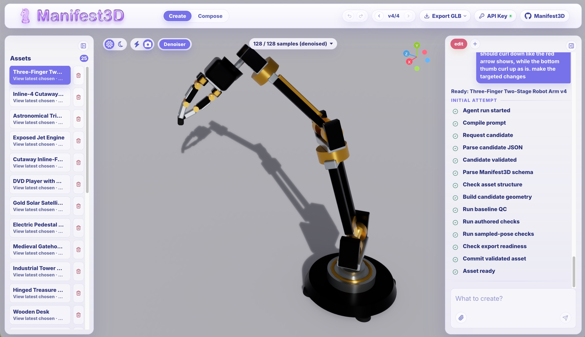

# Manifest3D

Taking inspiration from the [Articraft project](https://articraft3d.github.io/), Manifest3D is a mini procedural 3d asset factory that runs in your browser.

When running this app locally, add a `.env` file with at least one provider API key (see `.env.example`). OpenAI uses `OPENAI_API_KEY`; Gemini uses `GEMINI_API_KEY` or `GOOGLE_API_KEY`; OpenRouter uses `OPENROUTER_API_KEY`.

When using this app non locally, choose a provider from the in-app Providers panel and provide that provider's API key directly in app.
