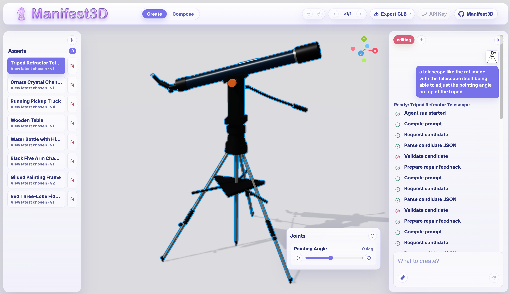

# Manifest3D

Taking inspiration from the [Articraft project](https://articraft3d.github.io/), Manifest3D is a mini procedural 3d asset factory that runs in your browser.

When running this app locally, remember to add a .env file with openai api key (see .env.example)

When using this app non locally, provide the API key directly in app